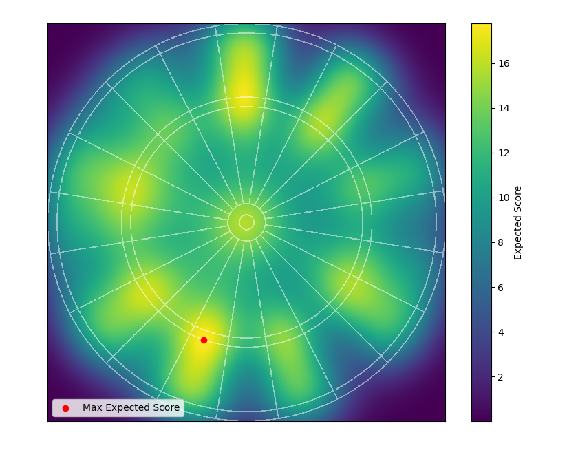
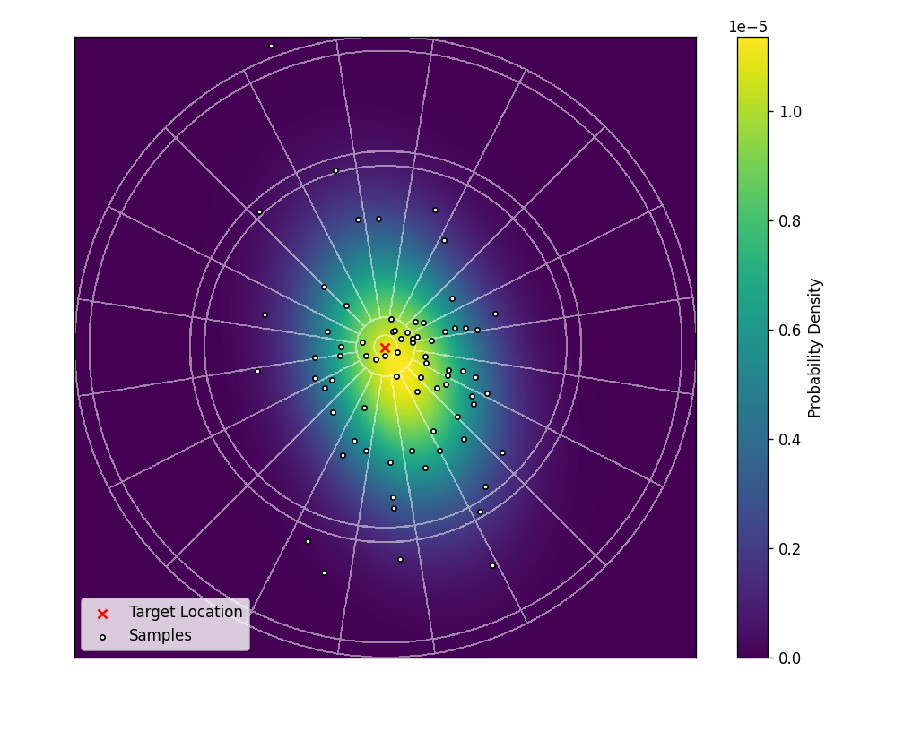

# PyDarts: A Python Darts Simulation Framework

This repository contains a framework for modelling and simulating the sport of darts using Python. It models the spatial distribution of a player's darts throw as a 2D Gaussian, from which allows for simulated player throws and the calculation of various metrics such as the expected score, probability of hitting a specific target and the optimal aiming location.

## Example Outputs

### A plot of the expected score calculated across the dartboard, with a marker showing the maximum, i.e. the location that the player should aim to maximise their long-term scoring average:

### A plot of the computed Gaussian distribution of a player's throw calculated from a sample of points where their darts landed when aiming for the bullseye:

### An animation showing how the optimal aiming location (i.e. the location that maximises the expected score) varies as the standard deviation of a player's throw increases (assuming the same standard deviation for x and y and no correlation):

